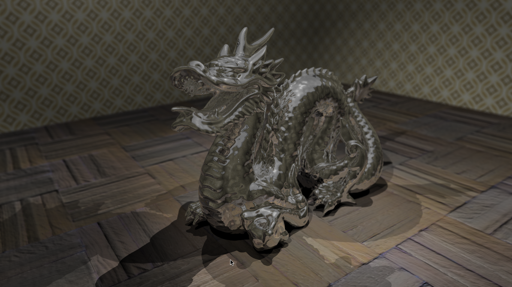
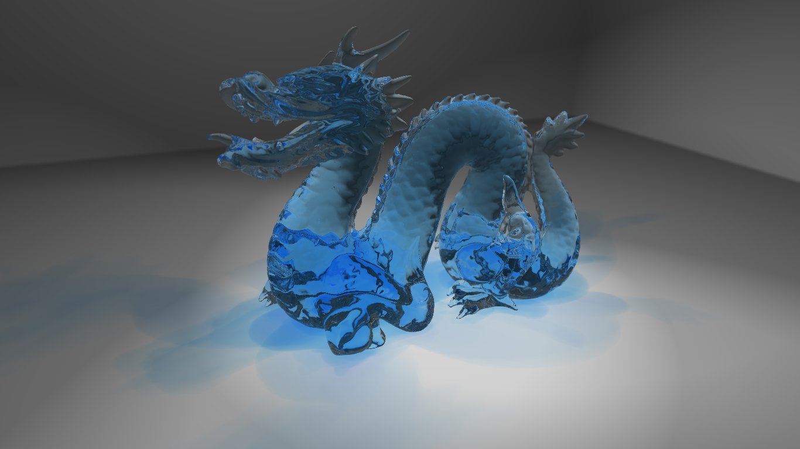

# proXo
A 3D graphic engine written in C++ from scratch. No hardware acceleration (only the CPU is used).
Two methods are implemented:
 * A real time engine: similar to those for video games but simplified.
 * A ray tracer: longer rendering but with realistic light effects (shadow, reflection, refraction...)

Why to implement a graphic engine? So many others exist and are much more powerful!
* For two reasons: fun and challenge.

## Features
### Real time engine

Take a look to this [video](https://www.youtube.com/watch?v=6xoTmThzS68)

*Keywords: Memory access efficiency/CPU cache, low level optimisation, fast inverse square root, multithreading, supersampling, light.*

### Ray tracer

Check out these [fantastic results](result/)!

 

*Keywords: light physics, refraction, reflection, absorption, KDTree, ray-triangle intersection, depth of field, texture, normal map, specular/ambient map.*

## Sample demo
It reads `.scene` files (*TODO: how to write a scene description file*).
It loads `.ply` files ([Stanford PLY - Wikipedia](https://en.wikipedia.org/wiki/PLY_(file_format))) exported from [Blender](https://www.blender.org/).

## Requirement
* For the sample, the only external libraries needed are [SDL 1.2](https://www.libsdl.org/index.php) and [SDL\_Image](https://www.libsdl.org/projects/SDL_image/). They can be installed on Ubuntu with: `sudo apt-get install libsdl1.2-dev libsdl-image1.2-dev`.
* The program can generated with a simple `make`. The core of the engine does not have any external dependency, thus it could be compiled apart.

## Coming soon
 * better way to reuse proXo.a in other project
    * public include/ dir
    * library for sdl binding
    * cmake export and dependencies
 * depth=0 intersection faces rasterization option
 * *Documentation for scene file format*
 * *Implement sky box* 
 * *Improve KD-Tree for ray tracer*
 * *Sample:*
    * *Help for keyboard control*
    * *Add few scenes and 3d models in this repository*
    * *Add screenshots*
 * Complete this ToDo list...
