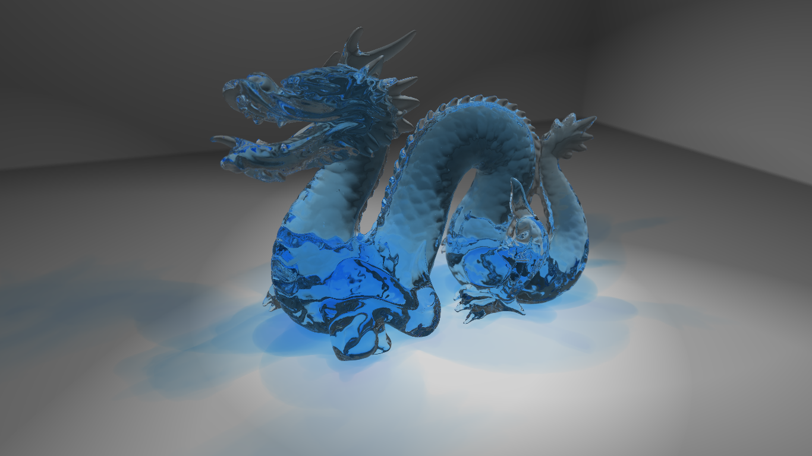

# Results
There are some examples of images rendered with proXo.
Most of these models come from the [Stanford 3D Scanning Repository](http://graphics.stanford.edu/data/3Dscanrep/).

## Dragon

**Mirror dragon**: full reflection, depth of field, normal map on the ground.

**Translucent dragon**: translucent material with refraction and colored light absorption.

## To Do
 * Add information about the rendering time and the number of casted rays.
